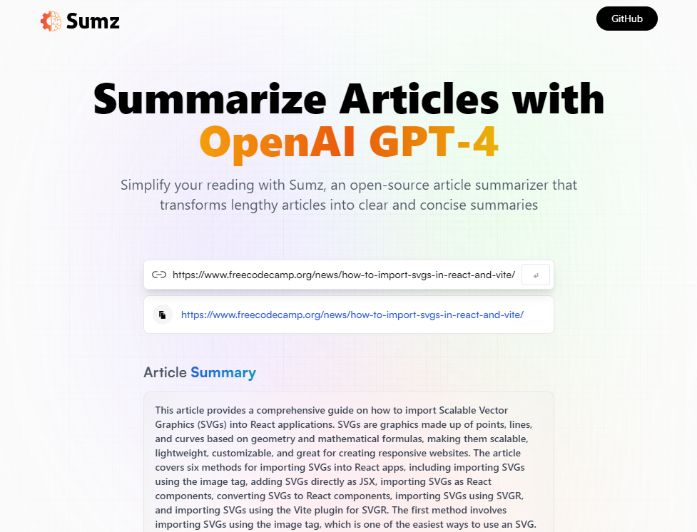

# AI Summarizer

## Table of Contents

- [AI Summarizer](#ai-summarizer)
  - [Table of Contents](#table-of-contents)
  - [About](#about)
    - [Built With](#built-with)
  - [Links](#links)
    - [Repository](#repository)
    - [Deployed](#deployed)
  - [Installation](#installation)
    - [Clone Repository](#clone-repository)
    - [Install Dependencies](#install-dependencies)
    - [Start Application](#start-application)

## About

SaaS website utilizing OpenAI API. Summarizes article by URL and saves URLs to local storage so you don't lose your progress.

### Built With

- React
- TailwindCSS
- Vite
- Deployed with Netlify

## Links

### Repository

🔗 [Repository](https://github.com/nrenner0211/ai-summarizer)

### Deployed

🔗 [Deployed](https://peppy-mermaid-8f969b.netlify.app/)

## Installation

### Clone Repository

`git clone git@github.com:nrenner0211/ai-summarizr.git`

### Install Dependencies

All NPM packages required for this application are already listed as dependencies in the package.json file. Run the command `npm i` in your terminal at the root directory level to install the packages.

### Start Application

Run the command `npm run dev` in your terminal. You can then view the app [Here](http://127.0.0.1:5173/)
